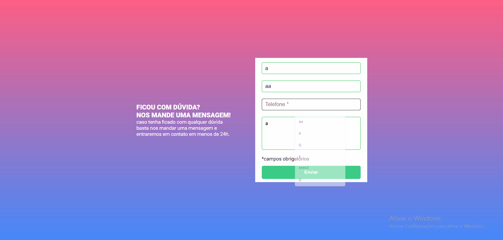
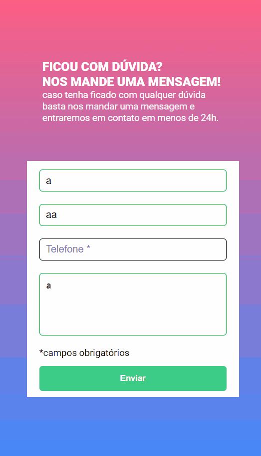

# Formulário com Validação
## Desafio HTML, CSS e JS intermediário
- Realizado no curso DevQuest

## Objetivo
- Validação do formulário feita com
javascript puro
- Ao clicar para enviar o formulário, se caso
algum campo não estiver preenchido, a borda
do input deve ficar vermelha e uma mensagem
de "campo obrigatório" deve aparecer embaixo
do campo que não foi preenchido

## Linguagens utilizada
- HTML 
- CSS
- JavaScript

### Layout Desktop

### Layout Mobile
